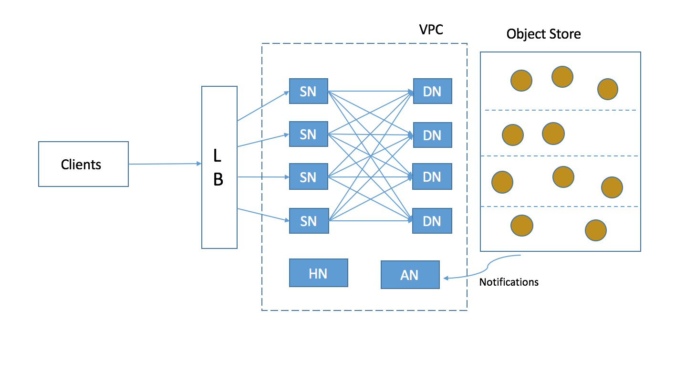
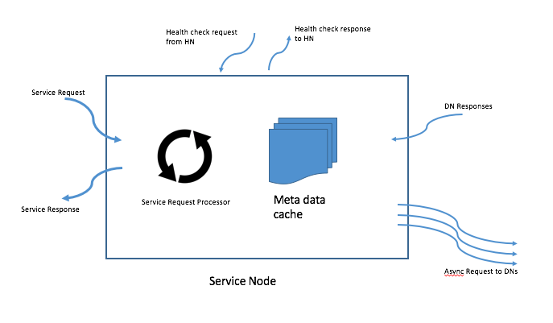
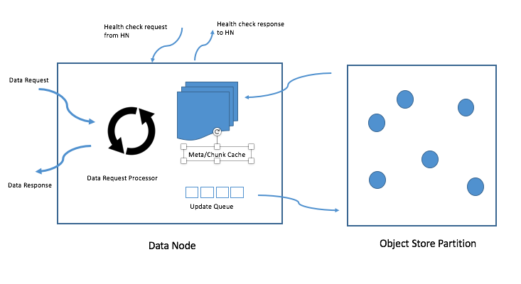
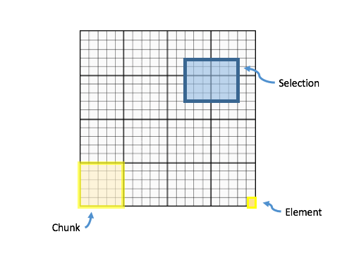
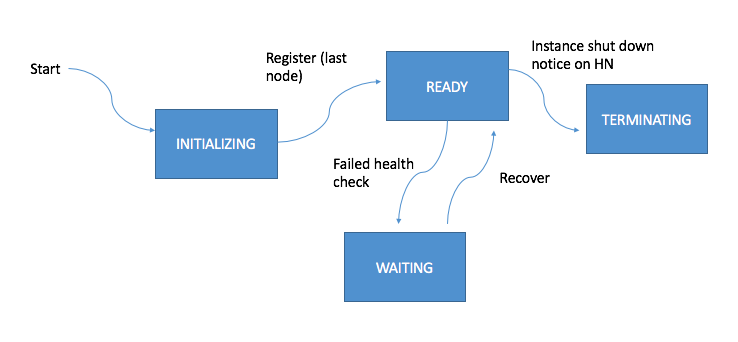

###############################
HSDS Architectural Design
###############################

John Readey - The HDF 

*jreadey@hdfgroup.org*

Intro
#####

This document describes the architectural design of the Highly Scalable Data Storage service (HSDS). HSDS is a REST-based service that implements the HDF REST API and uses an object store for persistent data.  

Related Documents
*****************

* The object storage schema is described in this document: "obj_store_schema.rst" 
* The HDF REST API is documented here: http://h5serv.readthedocs.io/en/latest/ 
* Instalation guide for HSDS: https://github.com/HDFGroup/hsds/wiki/Installation
* URS Authentication design: TBD
* HSDS Design document: https://s3.amazonaws.com/hdfgroup/docs/HDF+Scalable+Data+Service.pdf
* H5Serv developer documentation: http://h5serv.readthedocs.io/en/latest/index.html 
* HDF5/JSON specification: http://hdf5-json.readthedocs.io/en/latest/index.html 
* HDF REST API Authentication and authorization: https://www.hdfgroup.org/2015/12/serve-protect-web-security-hdf5/ 
* HDF Server: https://hdfgroup.org/wp/2015/04/hdf5-for-the-web-hdf-server/ 
* RESTful HDF5: https://support.hdfgroup.org/pubs/papers/RESTful_HDF5.pdf  

Motivation
##########

The HDF Server (h5serv) is a web-based service that implements the HDF Rest API, and has been effective in demonstrating the HDF Rest API.  However, it has constraints that limit its usefulness in a production environment.  Since h5serv utilizes the HDF5 library to read and write data to HDF5 files stored on the host, this implies the following limitations:

#. All requests to the server need to be handled serially (due to file-level lock used by the library)
#. Without a shared file system that supports locking, it is not possible to scale the service across multiple hosts
#. If there is a failure in the hardware (e.g. disk crash), any data written by the service and not backed up will be lost

Goals
#####

The design goals of HSDS include:

#. Client compatibility with the reference implement of HDF REST API (h5serv)
#. Ability to handle any size data repository (GB/TB/PB/EB)
#. Store data in S3 using schema described in the Object Storage Schema design doc
#. Cost Effective – in particular, overall cost should asymptotically approach base storage cost as system load decreases (e.g. ~$0.023 GB/month for S3)
#. Low Latency – Latency should be consistent with the amount of data transferred (regardless of whether the data is a self-contained object or a slice of a larger dataset).  
#. High Throughput – client throughput (MB/s) should only be limited the client’s network bandwidth and client’s architecture
#. Read/Write consistency – read and writes from a client are ordered and consistent (compare to the eventually consistent model of typical object stores (e.g. S3)
#. Scalable – System should be able to handle any number of clients without impacting performance (subject to delay of a few minutes while system adjusts to large shifts in client load)
#. Durability – storage durability (i.e. risk of losing an item) should be same as base object store (e.g. S3 is designed to achieve 99.999999999% durability)
#. Availability – system should have 99.9% uptime are greater
#. Portable – system should use only system components (e.g. object store, queues, virtual instances) that are common across most cloud computing platforms

Design Limitations
##################

The following limitations are explictily part of the design:

#. Performance may be limited if many clients simultaneously attempt to access the same data object (performance would be effectively limited to one data node)
#. The server may refuse (by returning a HTTP Status 413) certain queries that would return an extremely large response or take too long to process (e.g. a request that crosses thousands of chunk boundaries).
#. Performance will be degraded for several minutes when there is a sudden spike in load (as new hosts are spun up)

Definitions
###########

The following is some terminology used in this document:

**Chunking**: an HDF5 concept where the layout of a dataset is stored as a set of regularly sized pieces.  Applications can specify the chunk layout to be consistent with the expected usage pattern of the data

**Client**: Applications or system that use the HDF Rest API (typically via a client library such as HDF5Lib+VOL)

**Elastic Load Balancing**: A system that scales the number of hosts in a host pool in response to request traffic or work load

**DN = Data Node**: In HSDS’ architecture, data nodes fetch and store data to the object store

**HDF5 = Hierarchical Data Format**: a data model that can represent complex data objects 

**H5serv = HDF Server**: The reference implementation of the HDF REST API

**LB = Load Balancer**: a device that distributes application traffic across a number of servers

**Object Store**: A storage system that manages data as objects rather than a file system or block store 

**REST = Representational State Transfer**: an architectural style used for web applications

**S3 = Simple Storage Service**: Amazon AWS’ object store service

**Share Nothing Architecture**: A distributed computing architecture where none of the nodes share memory or disk storage

**SN = Service Node**: In HSDS’ architecture, store nodes are servers that are responsible for handling requests from the Rest API

**TPnn = Top Percentile Latency**: a measure of latency which measures the percent of requests that can be served under a given time.  E.g. TP99 of 20ms would mean the 99% of all requests are responded to in under 20 milliseconds

**UUID = Universally Unique Identifier**: a globally unique identifier that does not need to be generated by a central authority

HSDS Components
###############

The HSDS consist of several components that coordinate to process service request efficiently.  Each component runs as a single-threaded Python proceses.  To manage high request volumes, the number of components can be adjust to achieve greater throughput.  The components run on a set of hardware instances, ideally so that each compoenent will have a dedicated core. To enable inter-node communication, all requests between nodes will be through http requests.

The following diagram shows the logical layout of the components.  The diagram shows 4 SN and 4 DN nodes, but the architecture supports any number of nodes.

Notes:

* Clients can be one or more remote processes sending request serially or asynchronously
* LB (Load Balancer) is a infrastructure component that round robins request to SN nodes
* VPC (Virtual Private Cloud) provides security so that access to SN/DN/HN ports is only availalble to load balancer or internal componens
* SN (Sevice Node) nodes can send requests to any of the DN nodes
* DN (Data Node) nodes get request fro SN nodes, and make requests to object store (but don't talk to each other)
* Object store is virtually partitioned by the number  of DN nodes
* HN (Head Node) managed coordination of nodes and overall state of the system
* AN (Async Node) performs non time sensitive background tasks (e.g. deleting anonymous objects)
* AN is configured to recieve notifications from any change in the object store

Service Node
************

The Service Node (SN) component receives client requests (typically through a load balancer) and forwards requests to 1 or more DN nodes to perform the requested action.

Responsiblities of SN:

#. Validate that the request is well-formed
#. Authenticate username and password 
#. Authorize the requested action (e.g. for a PUT request, does the user have write permission for the given domain)
#. Determine which Data Nodes (DN) are needed to read or write the requested data
#. Construct requests and dispatch to DN nodes
#. Gather response from DN nodes and assemble client response
#. Respond to info requests with data on current state and system usage (memory, disk, request stats, etc.)

The following is a diagram of the SN:

Notes:

* Service requests are dispatched by the LB to a known port on the instances
* The "Service Request Processor" loop handles a requests as a single threaded process (but using async multi-tasking)
* One service request (e.g. dataset read) may translate to multiple DN requests
* Health checks are periodically sent by the HN
* For efficiency the SN may cache object metadata, rather than fetching from the DN on each access.  For meta data that is immutable (e.g. dataset type) this will always be valid.  For potentially mutable data (e.g. ACLs in the domain JSON), the SN will invalidate the cache value after a small time window (in this case the consequence  being that updates to the ACL may not immediately take effect).  Finally for some meta data items, such as dataset space for an extendible dataset, the SN may use the cached value but refresh if needed (e.g. to confirm that a given selection is valid).
* To manage memory efficiently, the metadata cache will have a limit on its maximum size, and a LRU algorithm will be used to eject items from cache as needed

Data Node
*********

The Data Node (DN) component receives requests from SN nodes and services the request based on either data maintained in its local cache or fetched from the object store.

Responsibilities  of DN:

#. Validates that the object key in the request corresponds to the DN's partition of the object space
#. If the requested object is not in the cache, fetch from object store
#. Construct response and return to SN node
#. For write requests, update the object in the cache, and flag to flush through to object store (Unless the config:     's3_sync_interval' is 0, in which case write to object store before responding to SN
#. Compress/Decompress chunk data from object store based on the filter parameters 
#. Write any pending data updates to object store    
#. Respond to info requests with data on current state and system usage (memory, disk, request stats, etc.)

The following is a diagram of the DN:

Notes:

* Data request may come from any of the SN nodes
* The "Data Request Processor" is single threaded as with the SN
* Each DN "owns" the objects in its object store partition
* Meta and chunk caches reduce number of requests to object store
* Meta and chunk caches are managed independently
* Chunk cache uses local disk, while meta cache is in memory
* Given that only this DN node should be modifying objects in it's partition, items in the cache always reflect the current state
* The "Update queue" is a queue of "dirty" objects in the meta and chunk caches that are written to the object store periodically
* For clients that wish to confirm write though to object store (to avoid potential data lost issues) the client can add option in the request, or use the domain flush request

Head Node
*********

The Head Node (HN) is a singleton component that is responsibility for coordinating the roles of other nodes in the cluster.  The HN is not directly involved in the processing of client requests but ensures the health and over all state of the cluster.

Responsibilities of HN:

#. Listen to register requests from other nodes and assign node number (equivalent to MPI 'rank') to each node
#. Maintain list of nodes and current state in the cluster
#. Modify cluster state as other nodes come online or go offline
#. Perform shutdown action to stop cluster 
#. Send health check (i.e. /info requests) to other nodes, mark node as offline is no response
#. Response to request for information about cluster state (/info and /nodestate requests)

Async Node
**********

The Async Node (AN) is a singleton component that performs actions that would be inefficient to perform as part of request processing.  The AN will listen to updates in the object store and perform any needed updates.

Responsibilities of AN:

#. Delete from the object store any objects that have become anonymous (unlinked)
#. Update the list of group, dataset, and committed type ids maintained for each domain
#. Update the storage size for datasets, and total storage size for domains
#. Update the dataset and domain stats (e.g. allocation size) when a dependent object (e.g. chunk of a dataset) is created, modified, or deleted
#. Update the domain checksum and domain checksum timestamp when a dependent object is modified.

Note: since this node functions outside the request/response logic of service processing, clients that modify the domain state in some way (e.g. by writing to a dataset), and then immediately query the domain checksum or domain stats, will not see their change reflected in the returned values.   

Data Node Partitioning
######################

Each object (Domain/Group/Dataset/Committed Type/Chunk) is a member of a virtual partition of the key space.  For a given key, the partition is determined by taking the numeric hash of the key and then the modulo of the number of DN nodes.  The SN will then use this number to direct request to the given DN.  Hence the state of any object will be managed by a specific DN.  This enables HSDS to limit the number of requests to the object store (since in many cases the object will be held in the local cache)and also to provide read/write consistency over a non-consistent object store.

Note: When auto-scaling is enabled, the number of nodes (and hence the object id to DN mapping) will change dynamically.  Logic for the management of objects during auto-scale transitions will be documented later in the project.

Functional Flows
################

In this section we examine a number of typical requests to the Service API and map how the request flows through the HSDS architecture.

Create New Group
****************

This section outlines the responses to a POST group request (create new group): http://h5serv.readthedocs.org/en/latest/GroupOps/POST_Group.html. 

#. Client submit POST /groups request to service endpoint
#. LB routes request to SN
#. SN authenticates client
#. SN retrieves domain JSON and verifies create action on behalf of requestor
#. SN generates a new UUID
#. SN determines DN assignee for group key
#. SN submits POST request to DN (does async wait for response)
#. DN puts group state in meta-data cache and marks as dirty (to be written to object store
#. SN gets response to POST request
#. SN returns response to client
#. DN writes group JSON to object store (in a background task)

Note: the new group will by anonymous, and such will eventually be deleted by the Asnc Node (AN).  The AN will provide a reasonable delay before deleting any newly created objects.  Clients will link the object to permanently persist the group.

Write to a Dataset
******************

This section outlines the response to a PUT dataset value requests: http://h5serv.readthedocs.org/en/latest/DatasetOps/PUT_Value.html.  

Note that the client may be writing the entire dataset or a selected hyperslab as described in the API.

In general, since the write request may overlap multiple chunks owned by different DN’s, the SN who receives the request may need to communicate with multiple DN’s to perform the read.  With async processing, the SN can dispatch multiple requests to DNs so that the write updates can be parallelized across multiple DNs.

The following diagram illustrates a dataset space and a typical selection region:

The dataspace is divided into a set of "chunks", which will each be stored as a separate object in the object store.  When the dataset if first created, none of the chunk objects will exist, but they will be created as dataset write selections overlap the chunk area.

Consider the blue selection region in the diagram.  A write over the selected area involves updating 4 chunks, which may be partitioned over 4 distinct DN nodes.  On receiving the request, the SN would make 4 async requests to the DN nodes to update their respective chunks, and wait for a response from each DN before returning the client response.

Note: Since we don't require the object storage system to support transactions, it's possible for a failed write to leave the dataset values partially updated (say chunks 1-3 are updated, but chunk 4 is not).  In this case it would be up to the client to retry the failed request.

#. Client submits PUT /datasets/<uuid>/value request to the service endpoint
#. LB routes requests to SN
#. SN authenticates client
#. SN retrieves domain JSON and verifies create action on behalf of requestor
#. SN retrieves dataset JSON (type, shape, and chunk layout)
#. For JSON data, SN transforms into binary data (as a Numpy Array)
#. SN determines the set of chunks that will need to be updated
#. For each effected chunk, an async PUT request with relevant data is sent to the DN that owns the chunk 
#. DN gets request to update chunk
#. If chunk is not present in data cache, chunk if fetched from object store
#. If chunk does not exist, chunk is initialized to dataset fill value
#. If the chunk read from object store is compressed, it is uncompressed
#. DN updates portion of the chunk as per the write selection
#. DN responds OK to requestor
#. Once SN gets OK response for all effected chunks, returns OK to client
#. Dn lazily flushes updated chunks to object store

Read from a dataset
*******************

This section outlines the response to a GET dataset value requests: http://h5serv.readthedocs.org/en/latest/DatasetOps/GET_Value.html. 

In general since the read request may overlap multiple chunks owned by different DN’s, the SN who receives the request may need to communicate with multiple DN’s to perform the read.  Async processing will be used so the DN actions can be performed in parallel.

#. Client submits GET /datasets/<uuid>/value request to service endpoint
#. LB routes requests to SN
#. SN authenticates client
#. SN retrieves domain JSON and verifies create action on behalf of requestor
#. SN retrieves dataset JSON (type, shape, and chunk layout)
#. SN validates request using dataset type and shape (e.g. hyperslab selection is within shape)
#. SN determines the set of chunks that will need to be queried
#. For each effected chunk, an async GET request with relevant data is sent to the DN that owns the chunk 
#. DN gets request to read chunk selection
#. If chunk is not present in data cache, chunk if fetched from object store
#. If chunk does not exist, chunk is initialized to dataset fill value
#. If the chunk read from object store is compressed, it is uncompressed
#. DN read portion of the chunk as per the selection
#. DN responds OK to requestor
#. Once SN gets OK response for all effected chunks, returns OK to client

Authentication and Authorization
################################

Authentication headers for client requests will be authenticated by SNs using the NASA URS service (https://urs.earthdata.nasa.gov/documentation).  For efficiency, the SN will cache validated headers for a given time to avoid latency and load on the URS system.  Details of HSDS/URS integration will be in a separate document.

Domain (and optionally group, datasets, and committed datatypes) can provide per-user authorization control lists (ACLs), as described in the HDF REST API (http://h5serv.readthedocs.io/en/latest/AclOps/index.html). 

Cluster Startup
###############

As the components of the HSDS cluster are brought online (e.g. using the admin/aws/create_instance.py script), the Head Node (HN) coordinates the different nodes in the cluster and maintains the overall cluster state.

The following state diagram shows the possible cluster state values and transitions between them.

Description of state values:

* INITIALIZING: Cluster is waiting on quorum of SN/DN nodes to register
* READY: Target number of SN and DN nodes have registered and the cluster is ready to receive requests
* WAITING: A node has failed a health check and cluster is not ready to receive requests
* TERMINATING: The HN is about to be shutdown.  SN and DN nodes should finish any inflight requests, but SN should not accept new client requests (return HTTP Status 503)

See the Installation Guide (https://github.com/HDFGroup/hsds/wiki/Installation) for specifics on bringing up the cluster.

 

 