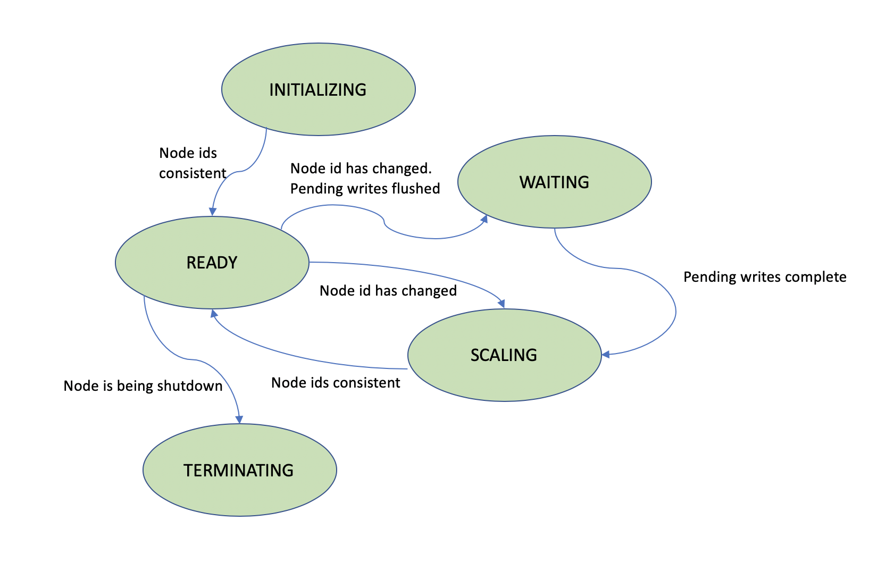

# HSDS Kubernetes Design

------

Running HSDS on Kubernetes would enable scaling (in terms of CPU and network bandwidth) beyond what is possible with a single machine.  This document will outline how HSDS can support Kubernetes with minimal changes to existing code.

------

## 0. Introduction

As a container based architecture, in principle in shouild be fairly easy to move from a Docker based deployment to a Kubernetes (K8S) Cluster deployment.  The main challenges are in how DN nodes will assign node ids to themselves (to form a partition of the S3 space) and how SN nodes will communicate with specific DN nodes (typically in Kubernetes clients connect to a service and thee actual container the client connects to is determined by the Kubernetes runtime).

To deal with this, we'll take an approach similiar to that used for OpenIO:

1. Eliminate head node, SN and DN nodes will use K8S API to discover other nodes
2. Assign node ids based on ordering of internal IPs (similar to how it works with OpenIO)
3. Manage health checks via SN nodes pinging DN nodes (again similar to how OpenIO works) and deal with pods dynamically being created, deleted, or moved
4. Use K8S load balancing rather than nginx
5. Use K8S secrets for AWS keys rather than passing environment variables
6. Logging

To simplify deployment and scaling, one SN container and one DN container will be bundled into a K8s "Pod".  In K8s, pods are the minimal deployable unit.  Since scaling happens at the pod level, the number of SN and DN containers will always be the same (which if fine for most use cases).

## 1. Node discovery

Using the python package for Kubernetes, a container can query for other pods running in the same kubernetes namespace.  Unlike with clients running outside the cluster, contiainers don't need passwords.   Here is an example of how this works: <https://github.com/kubernetes-client/python/blob/master/examples/in_cluster_config.py>.  In experimenting with this code, we do see 503 errors, so the RBAC will need to be configured to get around this security wall.  (Not clear if this a change to the cluster itself or just the HSDS deployment).

## 2. Assign node ids for DN nodes

Each DN node will query the K8S runtime to discover the IP/ports of the other HSDS pods (including itself).  This list will be sorted and then node ids assigned by the order in the list.  This action will be peformed periodically to catch any changes in the number of pods.  When a pods node id changes (e.g. as a result of a scaling event), any in-flight are pending S3 writes will be written before updating the node id.  In anycase, the meta-data and chunk caches will be invalidating (since these objects are specific to the partition for that node id).

SN nodes will also perform this action so that they have a map by node id of the DN nodes to communicate with.

Any given node will only set its state to "READY" when the node id from each pod in the cluster (via sending an /info request) matches what is expected based on the pod IP sorting.

## 3. Health checks

Each SN pod will ping each DN node and set the cluster state to READY if all DN nodes are healthy.  It will be assumed that any non-responsive DN node is a temporary state (i.e. not in endless crash loop) and the DN node will either respond or not show up on the least (say the pod is being deleted).

## 4. Node State

The following node states will be used by HSDS for K8s deployments:

1. INITIALIZING: This is the initial state of the node
2. READY: This state will be set when the node ids for each pod is consistent with the IP ordering of pods
3. WAITING: When a node's id changes, but it has pending writes, the node will go to the WAITING state till the writes are written to S3 (this only applies to DN nodes)
4. When a node's id changes but not all nodes are in a consistent state, the state will be set to SCALING
5. When a pod is being shutdown by K8S, a preStop request will be sent to the node, and the node state will be sent to TERMINATING.  Any pending writes will be written to S3 before the node returns from the preStop request.  Kubernetes will wait for the response from preStop before proceeding with the termination (as long as the request can be complete in the timeout window).

The following diagram illustrates the state transitions for ndoes:

## 5. Load Balancing and External Access

If external access to the HSDS is not needed (example it will only be using by other K8s applications),
load balancing between the different SN nodes will be via the K8S ClusterIP internal load balancer.

If external access is desired, an external load balancer will be used.  For AWS, the following annotations to the hsds service yaml can be used:

    annotations:
    # Note that the backend talks over HTTP.
    service.beta.kubernetes.io/aws-load-balancer-backend-protocol: http
    # Incudes ARN of the certificate.
    service.beta.kubernetes.io/aws-load-balancer-ssl-cert: arn:aws:acm:region:acctid:certificate/load_balancer_id
    # Only run SSL on the port named "https" below.
    service.beta.kubernetes.io/aws-load-balancer-ssl-ports: "https"

## 6. Secrets

Managing secrets (e.g. AWS authentication tokens) is the preferred method in K8s for handling sensitive information.  (In the Docker version we use environment variables).

## 7. Logging

K8s manages logs (basically just stdout from the containers) much like Docker does.

TBD: research methods for cluster-based log management (e.g. search and rotation).

## 8. Monitoring

Providers such as <https://uptime.com/> are avaiable that can monitor external endpoints and provide an alert if the service is down.

Additional AWS Cloudwatch can be configured to provide alarms based on specified criteria.  (TBD - provide more detail)

## 8. Cluster AutoScaling

For Kubernetes cluster using AWS EKS, the cluster can be configured with auto scaling: <https://docs.aws.amazon.com/eks/latest/userguide/cluster-autoscaler.html>.  For self-manged clusters using KOPS, and add on is avialble to provide auto scaling: <https://github.com/kubernetes/kops/tree/master/addons/cluster-autoscaler>.

When enabled Cluster Autoscaling (CA) has the effect that more VMs will be launched when pods cannote be scheduled due to lack of hardware resources.  Conversely when there is exccess capacity, the cluster can be down-scaled to save cost.

## 9. Horizontal Autoscaling

Cluster Autoscaling by itself will not scale up the number of HSDS pods when either the number of clients is excessively high, or a few number of clients are triggering a significant amount of work (e.g. selection requests that span large number of chunks).  To resolve this issue we need to setup Horizontal Autoscaling (HA) that scales up or down the number of HSDS pods based on a specific criteria.

Common metrics used with HA or CPU utilization or memory usaage, however for HSDS are better criteria would be when 503 (Server too busy) http responses are returned to the client.  Each HSDS node is configured to handle a specific number of inflight requests (defaulting to 100).  When this number is exceeded, a 503 response is returned.  Client libraries such as h5pyd know to use this as a signal to scale back the amount of requests being sent to HSDS. 

This will require the development of a custom autoscaler for 503 responses along with the configuration of approriatte heuresitcs for scalee up and scale down.  Scale up events that exceed the cluster capacity (leaving pods in pending state), will trigger CA to scale up the number of machines.
