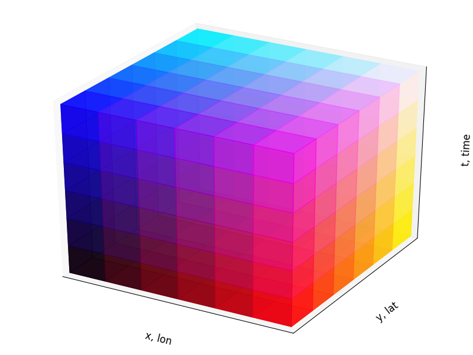
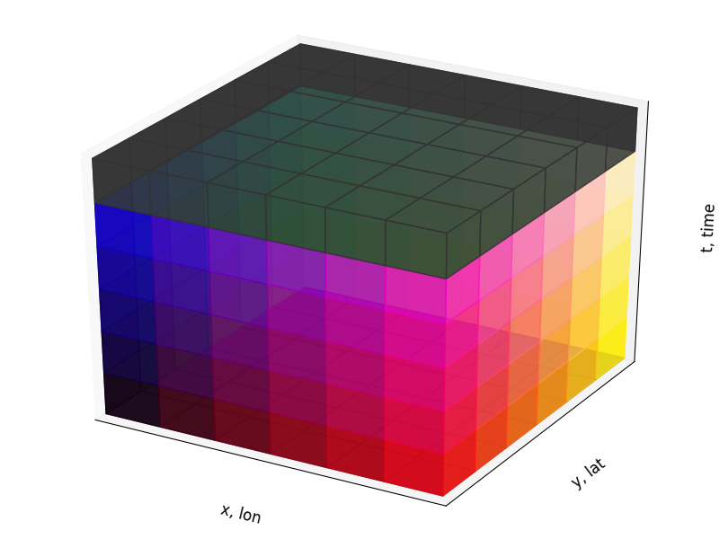
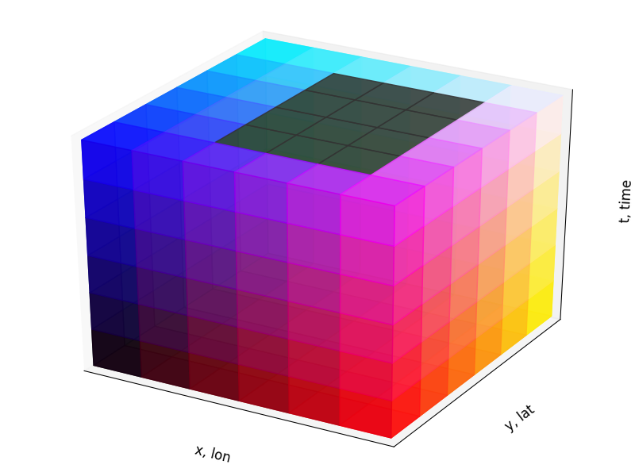

Extract a two dimensional subset from a dataset  
================================================

Context of use
--------------
End user `remote sensing <https://en.wikipedia.org/wiki/Remote_sensing>`_ and or earth system modeling output
products are commonly structured on fixed grids, as in x and y or longitude and latitude. Each grid may represents
some quantity over some time range. The structure is roughly illustrated in the following figure:

Description 
-------------
The extraction of the subset is for some time step **t** for all **x** and **y**, highlighted in black below:

The extract of a subset for some time step **t** for all **x** between **a** and **b** (x[a:b]) and for all **y** between 
**c** and **d** (y[b:c]), highlighted black below:

Scope
-----
system

Level
-----
user goal

Primary Actor
-------------
An earth science researcher, data analyst or application developer

Stakeholders and Interests
---------------------------
* An earth science researcher, data analyst or application developer who is interested in retrieving 
  NASA data products via web services
* A data provider who is interested in making available NASA data products via web services for broad user consumption
* A data manager 

Preconditions
--------------
1. An installation of HSDS on a cloud service provider (initially Amazon EC2).
2. The data product that was originally stored in HDF5 is correctly placed on an object store (initially 
   placed on Amazon Simple Storage Service (S3))
3. There is network connectivity between the client and the HSDS service
4. The user "knows" the dimensions of the data and the indices for the subset of interest 

Minimal Guarantee
------------------
1. HSDS accepts and logs the attempted request 

Success Guarantee
------------------
1. HSDS accepts and logs the attempted request 
2. The HSDS service presents `JSON <http://www.json.org/>`_ output to the client based on the parameters and indices 
   noted above in a *reasonable* response time

Main Success Scenario
---------------------
1. The user "connects" to the hsds data service endpoint 
   1a. The user may determine the bounds and or data set of interest either by querying the hsds service end-point or through some other means 
2. The user requests a subset of the data set based on a set of index parameters. e.g. conn_handle.tasmax[1, 2:4, 2:4].
3. The HSDS service returns JSON to the client based on the parameters and indices determined above
4. The users client accepts the JSON data from the hsds service and loads it into the appropriate data structure 
   for the application used by the users client.

